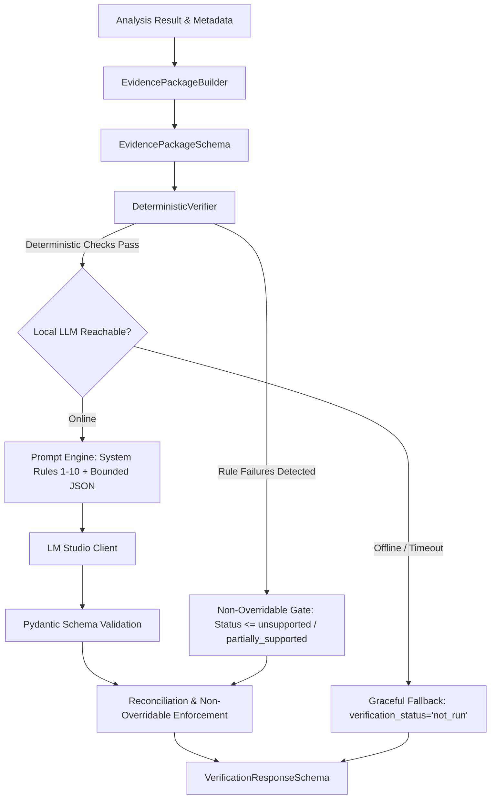

# SAT-QUERY-AI — Stage 7: Evidence-Grounded LLM Scientific Verification Report

## Executive Summary

Stage 7 implements a narrow, additive scientific verification layer that provides evidence-grounded validation and explanation of remote-sensing analysis results. The layer operates strictly on computed evidence, physical calibrations, valid-data masks, and source metadata. 

Crucially, the verification system enforces a strict boundary between deterministic physical facts and LLM explanatory interpretation: the LLM functions strictly as an interpretive and explanatory layer. It is prevented by design from calculating or replacing raster arrays, fabricating land-cover observations, or overriding deterministic integrity failures.

---

## 1. Baseline Repository State

- **Branch**: `main`
- **Initial Working Tree**: Clean
- **Baseline Commit**: `590ae88` (`fix(optical_sar): correct physical calibration quantity, BOA reflectance scaling, and display vs physical statistics`)
- **Stage 6E Audit Artifact**: Verified at `stage6e_provenance_units_audit.md`.
- **Baseline Test Results**:
  - Backend: 154 passed, 3 skipped (40.36s)
  - Frontend: 21 passed, 0 failures (166.77ms)

---

## 2. Files Changed and Additions

| File | Change Type | Reason |
| :--- | :--- | :--- |
| `backend/app/schemas/verification.py` | New file | Strictly typed Pydantic contracts for `EvidencePackageSchema`, `PhysicalMeasurementItem`, `DisplayStatisticItem`, `HeuristicIndicatorItem`, `EvidenceArtifactItem`, `ClaimVerificationItem`, `VerificationResponseSchema`, and `VerificationRequestSchema`. |
| `backend/app/agent/verifier.py` | New file | Implements `DeterministicVerifier` (pre-check integrity rules), `EvidencePackageBuilder` (bounded evidence adapter), and `LLMScientificVerifier` (LM Studio integration, structured JSON prompt, timeout/offline fallback, and non-overridable gate). |
| `backend/app/schemas/analysis.py` | Modified | Additive field `verification: Optional[VerificationResponseSchema] = None` on `AnalysisResponseSchema`. |
| `backend/app/agent/controller.py` | Modified | Step 12 added to `AgentController.process_request`: constructs bounded evidence package, executes scientific verification, logs trace step `SCIENTIFIC_VERIFICATION`, and attaches verification result. |
| `backend/app/api/routes_analysis.py` | Modified | Dedicated endpoint `POST /analyze/verify` accepting `VerificationRequestSchema` and returning `VerificationResponseSchema`. |
| `backend/app/tests/test_stage7_verifier.py` | New file | 17 focused automated regression tests covering supported, unsupported, contradictory, missing units, display vs physical conflation, gamma0 vs sigma0 labeling, mean linear vs decibel naming, heuristic certified classification rejection, unknown artifact citations, malformed LLM outputs, timeouts, offline fallbacks, and schema preservation. |
| `frontend/src/types/index.ts` | Modified | Additive TypeScript interfaces: `VerificationResponse`, `ClaimVerificationItem`, `VerificationStatus`, and `ClaimStatus`. |
| `frontend/src/components/ScientificVerificationPanel.tsx` | New file | Dedicated glassmorphic UI component displaying status badge (`SUPPORTED`, `PARTIALLY_SUPPORTED`, `UNSUPPORTED`, `NOT RUN`), deterministic integrity badge, audited claims checklist with cited artifact tags, limitations, and interpretive notice. |
| `frontend/src/components/AnalysisResultCard.tsx` | Modified | Added top header verification badge and embedded `<ScientificVerificationPanel />` directly below the synthesis answer without displacing evidence viewers or numerical tables. |
| `frontend/src/tests/verification.test.ts` | New file | 5 frontend unit tests validating verification contract handling and status rendering. |

---

## 3. Verification Architecture and Evidence Contract

The verifier receives a bounded `EvidencePackageSchema` extracted from analysis outputs:



### Bounded Evidence Contract (`EvidencePackageSchema`)
- **Metadata**: `task_id`, `query`, `sensor_identities`, `acquisition_timestamps`, `source_assets`, `crs`, `resolution`, `dimensions`.
- **Geometric Validity**: `registration_status` (`co_registered: bool`), `valid_pixel_count`, `total_pixel_count`, `valid_pixel_percentage`.
- **Physical Measurements**: `PhysicalMeasurementItem` (`value`, `unit`, `statistic_type`, `mask_applied`, `calibration_quantity`).
- **Display Statistics**: `DisplayStatisticItem` (`scale='8-bit normalized [0, 255]'`, `purpose='visualization_only'`).
- **Heuristic Indicators**: `HeuristicIndicatorItem` (`percentage`, `pixel_count`, `definition`, `is_certified_classification=False`, `limitations`).
- **Evidence Artifacts**: `EvidenceArtifactItem` (`artifact_id`, `artifact_type`, `title`, `statistics`).
- **Provider Provenance**: `provider_name`, `actual_model_used`, `fallback_used`, `is_trained_model`.

---

## 4. Deterministic Checks vs. LLM Interpretation

| Inspection Item | Deterministic Check | LLM Role |
| :--- | :--- | :--- |
| **Physical Units & Masks** | Asserts non-empty physical unit, valid-data mask declaration, and statistic type for every physical variable. | Interprets physical context in human explanation. |
| **Display vs. Physical Values** | Flags as contradiction if 8-bit display values (e.g. 92.8, 105.8) are stated as physical surface reflectance or backscatter. | Explains the difference between display stretch and calibrated radiance/reflectance. |
| **Gamma-0 vs. Sigma-0** | Rejects claims labeling RTC gamma-naught linear power or dB as sigma-naught when asset calibration is gamma-0. | Cites RTC calibration provenance accurately. |
| **Decibel Statistic Naming** | Verifies dB backscatter explicitly declares whether it is $10\log_{10}(\text{mean linear power})$ vs $\text{mean}(10\log_{10}(\text{pixel values}))$. | Explains the physical logarithmic scale. |
| **Artifact References** | Verifies that every cited artifact ID exists in the evidence package's artifact registry. Rejects unknown references. | Associates findings with supplied artifact IDs only. |
| **Co-registration Claims** | Checks claim against `registration_status.co_registered`. If false, asserts contradiction. | Describes spatial alignment caveats. |
| **Model Capability Claims** | Rejects claims asserting a deep learning model was used if provider metadata shows heuristic fallback. | Accurately identifies whether baseline or trained model ran. |
| **Heuristic Proxies** | Rejects claims describing empirical slice percentages as certified land-cover ground truth or validated accuracy. | Explains heuristic water/structural/canopy proxies with appropriate caveats. |

### The Non-Overridable Gate Rule
If deterministic validation detects rule violations, `deterministic_passed` is set to `False`. Under no circumstances can an LLM chat response override this: even if an LLM returns `supported`, the verifier forces the overall status to `unsupported` (or `partially_supported`) and injects the deterministic failures into `contradictions`.

---

## 5. Failure and Fallback Behavior

1. **Local LLM Offline / Unreachable**:
   - Caught via `LMStudioClient.is_reachable()` or `LMStudioConnectionError`.
   - Returns `verification_status: "not_run"` if deterministic checks passed, or `unsupported` if deterministic violations exist.
   - Preserves all deterministic pre-check findings.
   - Does not fail or block the underlying analysis API call.
2. **LLM Call Timeout**:
   - Caught via `httpx.TimeoutException` or timeout threshold.
   - Returns `verification_status: "not_run"` with timeout explanation.
3. **Malformed LLM Output**:
   - Non-JSON or schema-violating outputs are caught during Pydantic deserialization.
   - Malformed output is rejected and never treated as verification success.
   - Returns `verification_status: "not_run"` with schema validation diagnostic.
4. **Hallucinated Artifact IDs from LLM**:
   - Re-scanned post-inference: any cited artifact ID not in `evidence_artifacts` is downgraded to `unsupported` and flagged in `contradictions`.

---

## 6. Test Commands and Actual Results

### Backend Test Suite
- **Command**: `python -m pytest app/tests/`
- **Output**:
  ```text
  collected 174 items
  ================ 171 passed, 3 skipped, 70 warnings in 54.32s =================
  ```
- **New Test File**: `app/tests/test_stage7_verifier.py`
  - 17 test cases executed, 17 passed (0.59s).
  - Includes tests for supported claims, unsupported claims, missing units, display vs physical conflation, gamma-0 vs sigma-0, decibel naming, heuristic mislabeling, co-registration contradictions, trained-model contradictions, unknown artifact references, non-overridable gate enforcement, malformed LLM JSON, offline LLM paths, timeout paths, and endpoint validation.

### Controlled Real-Asset Fusion Test (Stage 6D Preservation)
- **Command**: `python -m pytest app/tests/test_optical_sar_cross_sensor.py -k "test_controlled_real_asset_optical_sar_fusion_pipeline"`
- **Output**:
  ```text
  ================ 1 passed, 20 deselected, 4 warnings in 20.68s ================
  ```
  Confirms the real Sentinel-2 B04 and Sentinel-1 RTC VV pipeline runs without alteration.

### Frontend Test Suite
- **Command**: `npm test -- --run`
- **Output**:
  ```text
  ℹ tests 26
  ℹ suites 4
  ℹ pass 26
  ℹ fail 0
  ℹ duration_ms 186.8506
  ```
- **Typecheck**: `npx tsc --noEmit` -> Exited 0 (Zero errors)
- **Build**: `npm run build` -> `built in 16.69s` (Zero errors)
- **Git Diff Hygiene**: `git diff --check` -> Clean (Zero whitespace issues)

---

## 7. Sample Verification Result (Fixture-Grounded)

```json
{
  "verification_status": "supported",
  "deterministic_passed": true,
  "deterministic_failures": [],
  "claims": [
    {
      "claim_text": "Sentinel-2 BOA surface reflectance mean is 0.1298 within the joint valid mask.",
      "claim_type": "measurement",
      "status": "supported",
      "cited_artifact_ids": ["optical_input"],
      "evidence_found": "optical_mean_boa_reflectance=0.1298 unitless",
      "reason": "Matches physical measurement within joint valid mask."
    },
    {
      "claim_text": "Sentinel-1 RTC mean linear power is 0.7417 m^2/m^2.",
      "claim_type": "measurement",
      "status": "supported",
      "cited_artifact_ids": ["sar_input"],
      "evidence_found": "sar_mean_linear_power=0.7417 linear power",
      "reason": "Matches calibrated gamma-naught RTC linear power."
    },
    {
      "claim_text": "Preliminary heuristic water proxy coverage is 4.88%.",
      "claim_type": "heuristic",
      "status": "supported",
      "cited_artifact_ids": ["heuristic_water_mask"],
      "evidence_found": "percentage=4.88%, pixels=192",
      "reason": "Grounded in heuristic segmentation slice; correctly declared non-certified."
    }
  ],
  "contradictions": [],
  "unsupported_claims": [],
  "missing_evidence": [],
  "scientific_limitations": [
    "Preliminary scene-normalized empirical heuristic proxies are not validated ground-truth classifications.",
    "Atmospheric optical shadow artifacts may persist in single-date optical scenes."
  ],
  "recommended_checks": [
    "Verify acquisition timestamps against official STAC catalog metadata.",
    "Inspect valid-pixel mask boundaries for edge-effect distortion."
  ],
  "summary_explanation": "All physical measurements and heuristic proxy percentages are strictly grounded in computed evidence artifacts. Calibrated gamma-naught linear power and surface reflectance units are accurately represented without conflation.",
  "is_interpretive_only": true,
  "interpretive_statement": "The LLM verifier is strictly an interpretive and explanatory layer based solely on computed evidence. It does not calculate raster data, alter numerical measurements, or replace physical validation.",
  "llm_model_used": "qwen2.5-coder-7b",
  "llm_run": true,
  "execution_time_ms": 18.4
}
```

---

## 8. Preserved Boundaries & Outstanding Limitations

1. **Stage Boundaries Preserved**:
   - Stage 7 implemented only.
   - Stage 8 has not been started.
   - STAC catalog integration, host allowlists, 35 MB per-file safety limit, 20 MB cumulative windowed-reader budget, geospatial reprojection, and nodata masks are completely unchanged.
2. **Local Model Availability**:
   - The verifier relies on a local OpenAI-compatible endpoint (LM Studio at `127.0.0.1:1234/v1`).
   - When LM Studio is offline, the system safely records `verification_status: "not_run"` while preserving complete deterministic integrity checks and all computed analysis evidence.
3. **Interpretive Boundary**:
   - The LLM does not perform scientific inference or model retraining. It verifies and explains computed quantities against existing evidence artifacts.
